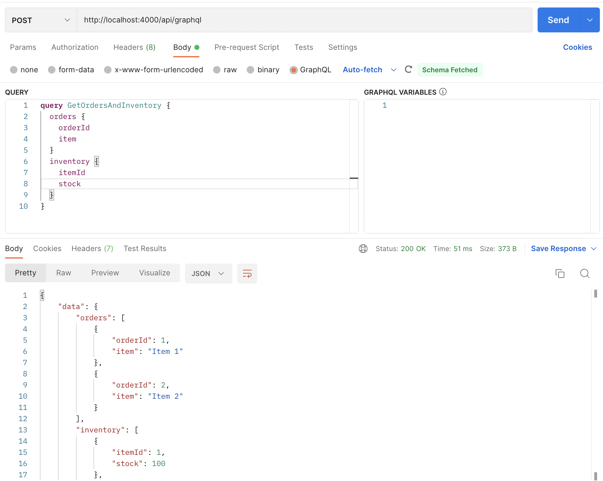
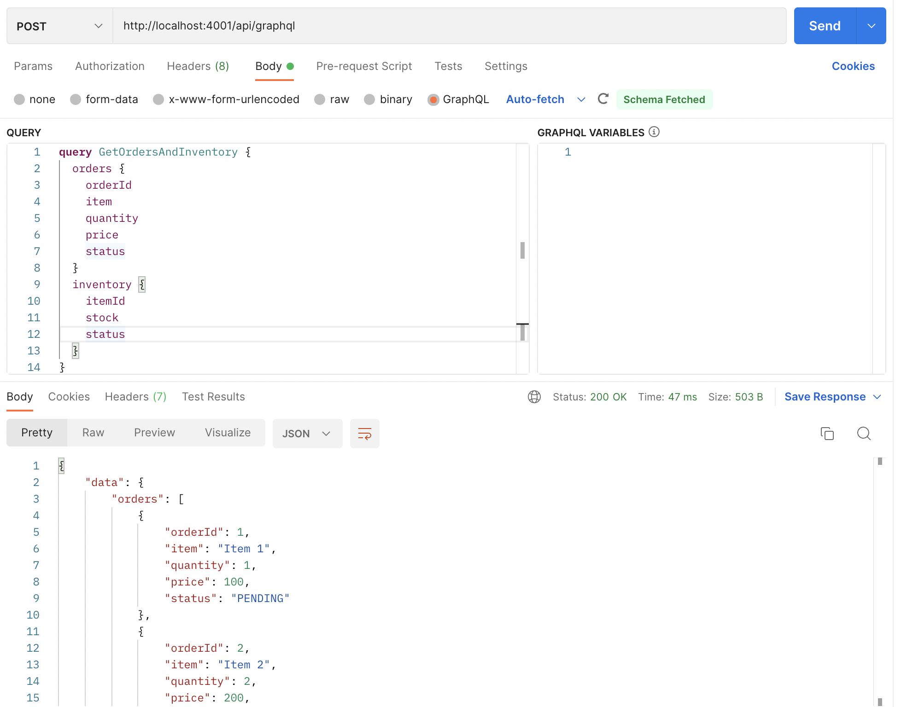
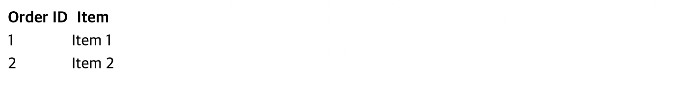
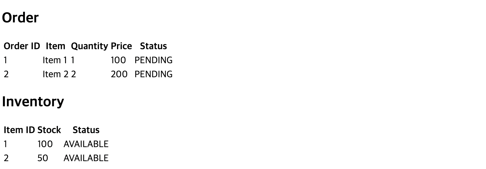

# 인스톨

```shell
npm run install:all
```

# 시작

```shell
npm run start:all
```

# 테스트

## backend-order
http://localhost:3001
```shell
curl --location --request GET 'http://localhost:3001/orders'
```

## backend-inventory
http://localhost:3002
```shell
curl --location --request GET 'http://localhost:3002/inventory'
```

## bff-mobile
http://localhost:4000
```shell
curl --location --request POST 'http://localhost:4000/api/graphql' \
--header 'Content-Type: application/json' \
--data-raw '{"query":"query GetOrdersAndInventory {\n  orders {\n    orderId\n    item\n  }\n  inventory {\n    itemId\n    stock\n  }\n}","variables":{}}'
```

**POSTMAN**


## bff-web
http://localhost:4001
```shell
curl --location --request POST 'http://localhost:4001/api/graphql' \
--header 'Content-Type: application/json' \
--data-raw '{"query":"query GetOrdersAndInventory {\n  orders {\n    orderId\n    item\n    quantity\n    price\n    status\n  }\n  inventory {\n    itemId\n    stock\n    status\n  }\n}","variables":{}}'
```

**POSTMAN**


## nextjs-mobile
http://localhost:8080



## nextjs-web
http://localhost:8081



